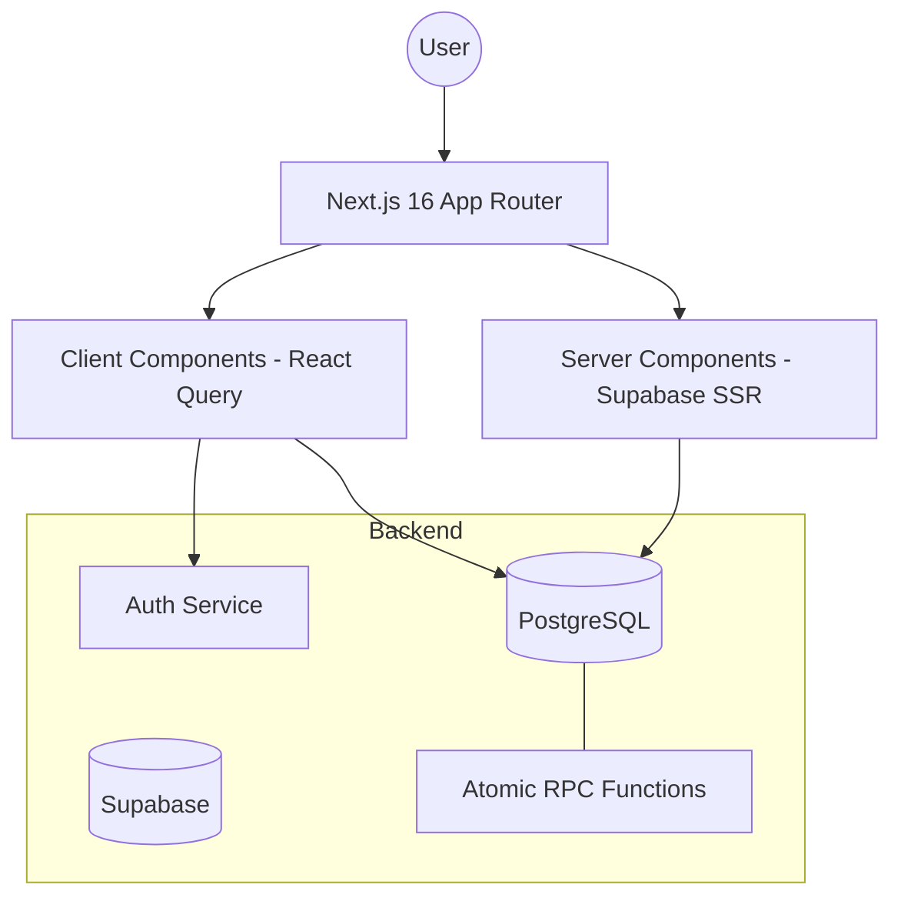

# 🚂 RRB Exam Preparation Platform - Architecture & Design Guide

Welcome to the definitive guide for the RRB Exam Preparation project. This document outlines the technical architecture, design system, and core logic of the application to facilitate future improvements in UI/UX, logic, and expansion.

---

## 🏗️ 1. System Architecture

The application is built on a modern, high-performance stack designed for scalability and real-time user feedback.



### Core Technologies
- **Frontend**: Next.js 16 (App Router), React 19
- **Styling**: Tailwind CSS 4.0
- **State Management**: TanStack Query (React Query) v5
- **Backend-as-a-Service**: Supabase (Auth, PostgreSQL, Real-time)
- **Icons**: Lucide React
- **Notifications**: React Hot Toast

---

## 🎨 2. Design System (UI/UX)

The project follows a **Premium Dark/Vibrant Aesthetic** designed to keep users engaged during long study sessions.

### Visual Identity
- **Primary Font**: [Inter](https://fonts.google.com/specimen/Inter) (Variable) - Selected for maximum readability.
- **Color Palette**:
  - `Indigo (#4f46e5)`: Primary action and brand color.
  - `Slate (#0f172a)`: Background and primary text.
  - `Emerald (#10b981)`: Success, Correct answers, and positive progress.
  - `Red (#ef4444)`: Errors, Incorrect answers, and time-critical warnings.
- **Glassmorphism**: Use of `backdrop-blur` and semi-transparent backgrounds for cards and overlays to create depth.

### Component Design Rules
- **Radius**: Large `20px` (or `rounded-3xl`) for cards, `14px` for inputs/buttons for a modern, friendly feel.
- **Borders**: Subtle `1.5px` borders with low opacity to define space without clutter.
- **Focus States**: Every interactive element must have a `focus-within` or `focus` state that uses a 4px soft ring (`ring-4 ring-indigo-500/10`).

---

## ⚙️ 3. Core Logic & Flows

### A. The Quiz Engine
Located in `src/app/test/[id]/QuizEngine.tsx`, this is the heart of the app.

1.  **Persistence**: Automatically saves `answers` and `currentIndex` to `localStorage`.
2.  **Security**: 
    - **Navigation Trapping**: Prevents the browser back button from exiting the test.
    - **Fullscreen API**: Forces focus by allowing users to enter immersive mode.
3.  **Real-time Scoring**: Calculates score and accuracy locally but persists via an atomic database call.

### B. Atomic Stats Update
We use a **PostgreSQL RPC** (`submit_test_attempt`) to ensure data integrity. In a single call:
- The attempt is marked as submitted.
- The user's total score is incremented.
- The test count is incremented.
- **Streak Logic**: The system checks the `last_active_date` (in IST) to decide whether to increment, maintain, or reset the user's daily streak.

---

## 🧩 4. Project Structure

```bash
src/
├── app/                  # Next.js App Router (Pages & API)
│   ├── dashboard/        # Main user overview & stats
│   ├── login/            # Polished Auth interface
│   ├── test/[id]/        # The core Quiz Engine
│   └── proxy.ts          # Global request handler (Next 16)
├── components/           # Reusable UI components
│   ├── Navbar.tsx        # Responsive navigation
│   └── LoadingSpinner.tsx# Brand-consistent loader
├── lib/
│   ├── api.ts            # Centralized API service (Supabase calls)
│   └── supabase/         # Client/Server/Middleware config
└── providers/            # React Context (Auth, Query)
```

---

## 🚀 5. Roadmap for Improvements

### UI/UX Enhancements
- [ ] **Testimonial Slider**: Add a section on the landing page for successful candidates.
- [ ] **Animated Progress**: Use Framer Motion for more fluid transitions between questions.
- [ ] **Dark Mode Toggle**: Allow users to switch between "Midnight Blue" and "Pure Dark".

### Logic Expansion
- [ ] **AI-Powered Recommendations**: Suggest topics based on accuracy trends.
- [ ] **Social Leaderboards**: Allow users to create private groups to study with friends.
- [ ] **Offline Mode**: Cache questions via Service Workers for low-connectivity areas.

---

## 🛠️ Development

To start the project:
```bash
npm run dev
```

To build for production:
```bash
npm run build
```

---
*Created by Antigravity for RRB Prep Platform.*
