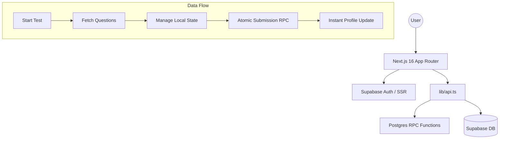

# Complete Guide

Welcome to the **RRB Exam Preparation Platform** technical guide. This document is the definitive reference for developers and product engineers, covering the entire lifecycle from question ingestion to high-concurrency exam delivery.

---

## 🏗️ 1. System Architecture

The platform is built on an **Atomic-Transactional** architecture. By pushing critical logic to the database layer (Supabase/Postgres), we ensure data integrity and sub-second performance even with massive datasets.

---

## 🧠 2. Test Logic & Generation

The platform distinguishes between two primary testing modes, optimized for different learning objectives.

### A. Fixed Topic Tests vs. Dynamic Mock Exams
| Feature | Topic-Wise Practice | Full Mock Exams |
| :--- | :--- | :--- |
| **Logic** | Static Question Set | Weighted Random Set |
| **Persistence** | Links saved in `test_questions` | Dynamic generation on-the-fly |
| **Goal** | Mastery of a single subject | Comprehensive exam simulation |
| **Topic Mix** | Single Topic | Balanced across all topics |

### B. Guaranteeing Uniqueness & Scaling
- **O(1) Random Selection**: We use a `random_id` float column. Instead of the slow `ORDER BY random()`, we fetch where `random_id >= random()`. This allows us to select 50 questions from a 100k+ dataset in under 50ms.
- **Deduplication**: For fixed tests, question IDs are mapped to the test ID. For dynamic tests, the system uses the `get_random_questions_v2` RPC which can be extended to exclude previously answered questions using a `NOT IN (SELECT question_id FROM attempt_answers)` filter.

---

## 🔄 3. Data Flow (The User Lifecycle)

1.  **Authentication**: User logs in via Supabase Auth; the `proxy.ts` (middleware) validates the session.
2.  **Dashboard**: React Query fetches `profile` and `recentAttempts` in parallel.
3.  **Start Test**: `startAttempt` inserts a row. If a user refreshes, the system retrieves the existing "in-progress" attempt.
4.  **Answering**: Each choice is saved to `attempt_answers` via `saveAnswer`. This ensures progress is never lost.
5.  **Submission**: Triggered by user or timer. The `submit_test_attempt` RPC runs.
6.  **Results**: User is redirected to `/result/[id]`, which provides a per-question breakdown.
7.  **Leaderboard**: The profile stats updated in Step 5 are immediately reflected globally.

---

## ⚡ 4. Atomic Submission System

### Why Atomic RPC?
Instead of making multiple calls from the frontend (which risk "partial success" on poor networks), we use a single **PostgreSQL Function**. 

**In one transaction:**
1.  **Mark Submission**: Set `is_submitted = true` (Prevents double-scoring).
2.  **Score Calculation**: The server calculates accuracy and records `time_taken`.
3.  **Profile Stats**: Atomically increments `total_score` and `tests_attempted`.
4.  **Streak Logic**: Decides whether to increment, hold, or reset the user's daily streak based on the last active date (IST).

### Failure Handling
- **Double Submission**: The RPC checks if `is_submitted` is already true. If so, it returns the current data without re-processing.
- **Network Failure**: If the network fails before the RPC completes, the `is_submitted` flag remains false. The user can retry the submission upon reconnecting.

---

## 🏎️ 5. Performance Engineering

- **No `ORDER BY random()`**: In SQL, `random()` forces a full table scan. Our `random_id` index strategy makes selection instant.
- **Limited Fetching**: All question queries use strict `LIMIT` clauses to minimize payload size.
- **Batching**: 90k+ question datasets are ingested using JSON streaming to avoid memory pressure on the server.

---

## ⚠️ 6. Edge Cases & Resilience

| Scenario | System Behavior |
| :--- | :--- |
| **Browser Refresh** | `localStorage` + `attempts` table sync. Test resumes exactly where it was. |
| **Timer Expires** | Frontend triggers `handleAutoSubmit()` immediately. RPC finalizes the test. |
| **Tab Closed** | The timer continues on the server. The user can return and finish if time remains. |
| **Duplicate Clicks** | RPC-level locking ensures stats are only updated once per attempt ID. |

---

## 🛠️ 7. Developer & Debugging Guide

### Key Functions
- `generateTopicTest(topic)`: Creates/links questions for focused practice.
- `generateMockTest()`: Algorithmically picks a balanced set from all topics.
- `submit_test_attempt()`: The atomic backend core.

### Debugging Steps
1.  **Supabase Logs**: Check the "Database" -> "Query Performance" tab in Supabase to find slow RPCs.
2.  **RPC Errors**: If a submission fails, the frontend logs the specific Postgres error code. Search the [PostgreSQL Error Codes](https://www.postgresql.org/docs/current/errcodes-appendix.html) list.
3.  **Auth Issues**: Use the "Auth" -> "Users" tab to verify if the user exists and has a matching entry in the `profiles` table.

---

## 🚀 8. Setup & Scaling
1.  **Local**: `npm install` -> `npm run dev`.
2.  **Data**: Run `supabase/bulk-import.ts` to populate questions.
3.  **Scale**: As the user base grows, implement **Read Replicas** for question fetching while keeping `attempts` on the primary instance.

---
*Maintained by the RRB Technical Architecture Team.*
